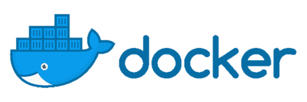

# Software "in blik"

Docker is de voorbije jaren uitgegroeid tot de belangrijkste standaard in **container-technologie** – een nieuwe manier om software, vaak zelfgeschreven, in te pakken en uit te rollen. Zo moet je niet langer rekening houden met hardware en specifieke configuratie-parameters. Je maakt ook veel zuiniger gebruik van de fysiek beschikbare rekenkracht. Klinkt interessant? Het vraagt wel een heel andere manier van werken.

Containers en hun beheerplatformen zoals Kubernetes zijn in enkele jaren uitgegroeid van spitstechnologie bij internetgiganten zoals Google, tot [een populaire ICT-bouwsteen voor bedrijven](https://www.techzine.be/nieuws/cloud/38721/forse-toename-kubernetes-en-containers-bij-bedrijven/). Zowel op de eigen infrastructuur als in externe hosting, [wint de technologie snel terrein](https://diamanti.com/wp-content/uploads/2019/06/Diamanti_2019_Container_Survey.pdf). Terwijl gespecialiseerde kennis nog de voornaamste drempel is, zijn er tal van voordelen.

Door je toepassing in meerdere containers naast elkaar te laten draaien, kun je de middelen nodig voor je applicatie quasi **onbeperkt uitbreiden**. Natuurlijk moet je aan het onderliggende ‘platform’ de nodige hardware toevoegen naarmate de werkelijke last blijft stijgen. En je moet de tientallen, honderden of duizenden connecties ook netjes spreiden.

Een bijkomend voordeel wanneer je meerdere containers naast elkaar plaatst om exact hetzelfde te doen, is dat je een **foutbestendige architectuur** krijgt. Loopt er een container vast, dan nemen de andere de extra verkeerslast over. Binnen enkele seconden kun je extra containers laten opstarten, zodat er geen overbelasting ontstaat. Het resultaat is een hoge beschikbaarheid, zonder een forse meerprijs.

Al **tijdens het bouwen van je toepassing** of website denk je na over de ‘niet-functionele’ noden: responstijden, aantal simultane gebruikers, performance-optimalisatie, beveiliging… In het cloud-tijdperk bepaal je dit vooraf, tijdens de ontwikkelfase. Welke systeembronnen en configuratie-parameters heeft deze toepassing nodig? Heb je de optimale configuratie gevonden? Dan stop je ze mee in de containers, en het onderliggende platform zorgt voor de rest.

Containers zijn [geen virtuele machines (VM)](https://www.techzine.be/blogs/cloud/24172/waarom-containers-geen-virtuele-machines-zijn/). In de klassieke vorm van virtualisatie, bevat elke fysieke server een aantal ‘virtuele’ servers, tot de grenzen van de onderliggende hardware bereikt zijn. Op de fysieke server zit dan een hypervisor-laag, waarop meerdere VM’s draaien, met daarop telkens een volwaardig besturingssysteem en software-toepassing(en). Containers hebben **veel minder ‘overhead’**, zodat je in een klassieke VM-aanpak [tot vijf keer meer rekenkracht](https://diamanti.com/wp-content/uploads/2019/06/Diamanti_2019_Container_Survey.pdf) nodig hebt voor dezelfde werklast (‘VM-taks’). In een klassieke VM-aanpak is het ook lastig om virtuele servers te beschermen tegen een naburige toepassing die erg veel rekenkracht, geheugen of opslag vreet.

Hoe schakel je dan om naar containers? Het is belangrijk om goed te beseffen wat dat voor gevolgen heeft, in het bijzonder voor de manier waarop je toepassingen ontwikkelt, of laat ontwikkelen. Het gaat echt om **een andere manier van werken,** zelfs van denken en van verantwoordelijkheid nemen. Containers passen perfect in een DevOps-aanpak, waarbij de klassieke tweedeling tussen software-ontwikkeling en infrastructuurbeheer verdwijnt.

Elke container bevat configuratie-details, libraries en alle andere nodige componenten om de toepassing **onmiddellijk te laten opstarten**. Er komt geen installatie meer aan te pas. Dit maakt capaciteitsuitbreiding net zo snel en makkelijk. Het opstarten van nieuwe, identieke containers is volledig automatiseerbaar. Het is de manier waarop internetgiganten zoals [Google](https://cloud.google.com/containers/?hl=nl) werken.

Voor complexe toepassingen is de recente trend trouwens om elke applicatie verder uit te splitsen in **kleinere functionele onderdelen of \*microservices\***. Dit heeft belangrijke operationele voordelen… Grondige wijzigingen in de code kunnen worden verpakt en uitgerold als een nieuwe container, terwijl de andere onderdelen ongewijzigd blijven. Je vermijdt zo een ingewikkeld kluwen van afhankelijkheden. Daarnaast kun je ook erg selectief bijschalen, door meer resources te voorzien exact daar waar er vertraging of overbelasting optreedt.

In werkelijkheid kies je zelden om één of enkele containers op te zetten en uit te rollen. Je gebruikt ze voor testing, acceptatie en productie. In een microservices-architectuur zet je in elk van die omgevingen meerdere, of meerdere tientallen containers op. En om **performant en fouttolerant** te werken, ontdubbel je elke container. En je schaalt verder bij waar nodig. Ook al is het niet moeilijk om vanaf een bestaande *image* snel nieuwe containers op te zetten, toch loont het de moeite om maximaal te automatiseren. Zeker als het gaat om tientallen, honderden of zelfs duizenden containers.

Wat typisch *niet* in de container zit, is elke vorm van gegevensopslag. Je cloud-toepassing ontvangt en verwerkt wel gegevens, maar slaat ze vervolgens op in een achterliggende databank, of geeft ze via webservices of een API-platform aan nog een ander systeem door. Je zet dus nooit meer je applicatie(s) en je databank op één systeem, al was dat om veiligheidsredenen ook vroeger al een slecht idee.

Precies **de onveranderlijke (\*stateless\*) aard** van de container zorgt ervoor dat je die op elk moment kunt stoppen, dupliceren of herstarten. Maar daar moet je toepassing natuurlijk wel mee overweg kunnen. Oudere toepassingen zijn typisch niet zomaar geschikt voor containers, tenzij na een grondige re-engineering. 

Dankzij DevOps zien we software-ontwikkeling en infrastructuurbeheer steeds meer als één geheel. De instellingen voor veiligheid, beschikbaarheid en performance stop je met je software samen in één doos: de Docker-container. Software uitrollen wordt zo héél simpel – een beetje zoals een kant-en-klaar-maaltijd serveren, in plaats van telkens opnieuw alle aparte ingrediënten bij elkaar te koken.

## Waarom stop je software in een container?

Wanneer je zelf software schrijft, begin je eigenlijk nooit echt vanaf nul. Je bouwt verder op bestaande zaken zoals het besturingssysteem, bibliotheken, drivers, plug-ins, runtime-omgevingen, anders werkt je toepassing niet.

**In een klassieke aanpak** moet je eerst alle lagen bovenop het besturingssysteem zelf installeren, op je eigen computer, server of virtuele server. Is je toepassing dan eindelijk klaar – na veel denkwerk, programmeren, testen en verbeteren? Dan mag je de hele oefening nog eens overdoen in de live-omgeving. Er zijn kortom heel wat nadelen aan de klassieke manier:

- **Veel gedoe voor niets:** de installatie van je infrastructuur en alles wat erbij komt, is repetitief werk, waar je als software-ontwikkelaar liever niet mee bezig bent. Wil je bovendien een tweede of een derde server, omwille van prestaties of betrouwbaarheid, dan kan je de klus nog eens helemaal opnieuw doen.
- **Risico op fouten:** kleine versie-verschillen tussen de ontwikkel-, test- en live-omgeving kunnen een grote impact hebben. Wat al de hele tijd feilloos lijkt te werken, kan op het moment van de go-live toch plots voor problemen zorgen.
- **Beperkte resources:** in een klassieke ICT-aanpak bepaalt de hardware hoe snel of traag je systeem werkt. Wil je meer rekenkracht, dan moet je resources toevoegen. Heb je resources teveel? Dan blijven ze ongebruikt. Zet je dankzij virtualisatie meerdere virtuele servers samen op dezelfde hardware? Dan vermenigvuldigt het aantal besturingssystemen, bibliotheken… en zo vreet je je rekenkracht op.

**Containers** zijn een stuk compacter en bevatten enkel het hoogst nodige. Ze maken veel zuiniger gebruik van je resources. Je kunt de gewenste configuratie bewaren als een ‘image’ – een soort ‘foto’ van de volledige installatie. Die kun je dan één keer, drie keer of tientallen keren opnieuw uitrollen. Dat gaat snel en eenvoudig, eventueel zelfs [volautomatisch met een container-platform zoals Kubernetes](./wat-is-kubernetes.md). Door al het nodige samen in een container te stoppen, elimineer je niet alleen de manuele installatie van je systeem. Ook het bijhorende risico op menselijke fouten verdwijnt.

## Hoe werkt Docker eigenlijk?

In je Docker container stop je al wat je toepassing nodig heeft om te functioneren. Niet minder, maar ook niet meer. Alle parameters zitten mee in de doos. Het is een volledig autonoom mini-systeem, dat je enkel nog hoeft te starten of te stoppen.

Alles wat je toepassing *niet* nodig heeft, hoeft er ook niet in te zitten. Dat zorgt ervoor, samen met het gemeenschappelijk gebruik van onderliggende bibliotheken en besturingssysteem, dat je heel zuinig gebruik maakt van je resources.

Je software bouwen, verpakken en publiceren verloopt totaal anders met Docker. Je verfijnt de code en de infrastructuur-parameters tot alles volledig naar wens is. Dan maak je een ‘foto’ (image). Zoals je meerdere afdrukken van een foto kunt maken, zet je het image om in één of meerdere containers. Als je de code of parameters ook maar een beetje wil veranderen, herhaal je het hele proces:

- **Docker file:** dit eenvoudige tekstbestand dient als ‘blauwdruk’ en omschrijft hoe je gewenste ‘Docker image’ eruit zal zien.
- **Docker image:** als ontwikkelaar kun je vaak verder bouwen op een bestaand basis-image waarin de gewenste tools zitten. Op DockerHub vind je bijvoorbeeld een startklare omgeving voor bijvoorbeeld Ruby of NodeJS. Als het resultaat perfect is, kun je je image vastleggen (build) en publiceren.
- **Docker container:** vanaf je image, standaard of zelfgebouwd, start je een zelfstandig systeem op (run). Dit is herhaalbaar en onveranderlijk.

## Wat zijn de voor- en nadelen van Docker?

Installeer je je toepassing op meerdere servers tegelijk? Rol je vaak nieuwe versies uit? Dan heb je reden genoeg om van een ‘ambachtelijke’ naar een ‘industriële’ methode over te stappen. Het vraagt een andere aanpak, typisch voor de DevOps-filosofie. Daar moet je minstens even aan wennen, alvorens te genieten van de voordelen:

- **Beheersbaar:** elk systeem in een Docker-container kun je meteen stoppen, starten en vermenigvuldigen. Loopt een container vast, dan heeft dat geen invloed op andere systemen, ook al draaien ze fysiek samen op dezelfde host-machine.
- **Uitbreidbaar en foutbestendig:** zet je meerdere containers naast elkaar, dan kun je een plotse piek in de verkeerslast beter spreiden. Als je bovendien orkestratie gebruikt, dan kun je volautomatisch extra nodes opstarten en een vastgelopen systeem herstarten.
- **Platform-onafhankelijk:** is je toepassing afhankelijk van specifieke versies, configuraties of van webservices op een ander systeem? Vooral in grotere toepassingen kunnen de onderlinge afhankelijkheden een simpele systeem-upgrade veranderen in een aartsmoeilijke puzzel. Met Docker werk je volledig systeem-onafhankelijk. Je gebruikt binnen elke container de gepaste versie, en zo hoef je niet alles in één keer te upgraden.
- **Performant:** Docker zet elke container rechtstreeks bovenop het host-besturingssysteem – het enige besturingssysteem. Containers hebben toegang tot gemeenschappelijke gegevensopslag. Bestanden die door meerdere containers in gebruik zijn, staan slechts één keer opgeslagen. Zo is er véél minder ‘overhead’.

Docker werkt fundamenteel anders dan een virtuele machine (VM): een VM doet zich eigenlijk voor als een klassieke hardware met processoren, geheugen en opslag. Eventueel deel je de beschikbare resources op voorhand op tussen meerdere VM’s, waarop dan telkens een volledig besturingssysteem met alle toebehoren draait. Bovendien zorgt een hypervisor – en daaronder nog maar eens een besturingssysteem – ervoor dat de VM’s netjes van elkaar afgeschermd zijn. Zo reserveer je je rekencapaciteit in vele kleine stukken. VM’s zijn kortom minder rigide dan *dedicated hardware*, maar erg kwistig met resources en niet zo flexibel. Volgens studies heb je met containers tot [vijf keer minder rekenkracht nodig](https://diamanti.com/wp-content/uploads/2019/06/Diamanti_2019_Container_Survey.pdf) voor dezelfde werklast als met VM-technologie.

De belangrijkste uitdaging aan werken met Docker is dat je er conceptueel en technisch mee overweg moet kunnen. Vind je DevOps maar niets, en microservices te ingewikkeld, dan is Docker misschien toch niet jouw beste keuze.

- **Oudere toepassingen:** De meeste oudere toepassingen zijn niet zomaar geschikt om in containers onder te brengen.
- **Compacte code:** Een Docker-container bevat het hoogst nodige. Om de inhoud van je container eenvoudig en onderhoudsvriendelijk te houden, kiezen velen ervoor om een complexe toepassing op te knippen in aparte functionele stukjes of *microservices*. Wil je niet met microservices werken, of hang je vast aan architectuurkeuzes uit het verleden, dan zijn containers misschien niet aangewezen.
- **Technische kennis:** DevOps en microservices zijn uitstekende keuzes als je een nieuwe toepassing schrijft met een hedendaagse architectuur. Uiteraard moet je die concepten ook door en door begrijpen.

