# Entity Framework Core "Code First"

## Annotaties of Fluent API

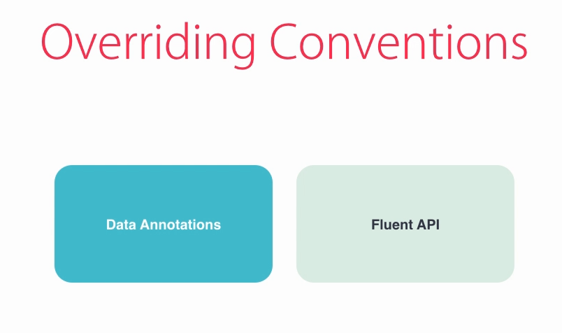

Courses table

Description kolom: nvarchar(MAX), nullable

EF interpreteert dit op deze manier standaard. Wens je nullable == false?

Ofwel gebruik je dan een annotatie:

```plain
[Required] 
```

uit System.ComponentModel.DataAnnotations

Je voert vervolgens uit in Package Manager Console:

```plain
add-migration foo
```

Bekijk nu de migratie: 

```plain
nullable: false
```

We voeren deze niet uit met 

```plain
Update-Database 
```

en verwijderen de migratie: gewoon een "delete" van de migratie is voldoende omdat we deze nog niet uitvoerden.

Ofwel: "Fluent API"

ga naar context, methode OnModelCreating(). 

```C#
modelBuilder.Entity<Course>(). Property(t => t.Description).IsRequired();
```

Je kan methods "chainen".

```plain
add-migration foo
```

Bekijk de migratie: je ziet hetzelfde resultaat.

Wat is nu het beste? 

Annotaties: 

- minder code
- minder flexibel, vb. voor het configureren van relaties tussen klassen
- je klassen worden vervuild met databankkennis. Annotaties als "foreign key" zijn databankspecifiek. "Separation of Concern" is minder goed
- voor een eenvoudige applicatie zijn annotaties nog verdedigbaar. 
- ix de twee benaderingen echter niet, want dan wordt je onderhoud veel moeilijker!

**Conclusie: beter Fluent API.**

Voorbeelden van Annotations:

```C#
[Table("tbl_Course")]

[Column("sName", TypeName="varchar")]

[Key] [DatabaseGenerated(DatabaseGeneratedOption.None)] : None, Identity, Computed

[MaxLength(255)]

[Index(IsUnique=true)] of [Index("IX_AuthorStudentsCount", 1)]

[ForeignKey("Author")]
```

## Fluent API


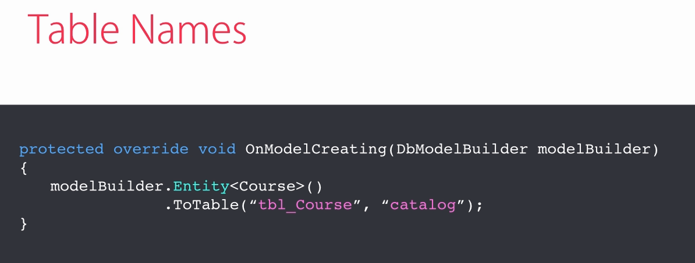

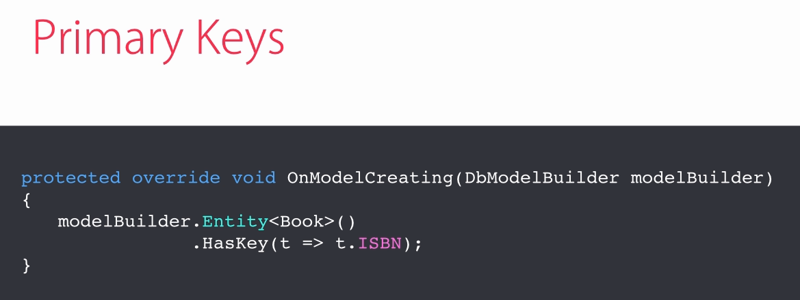

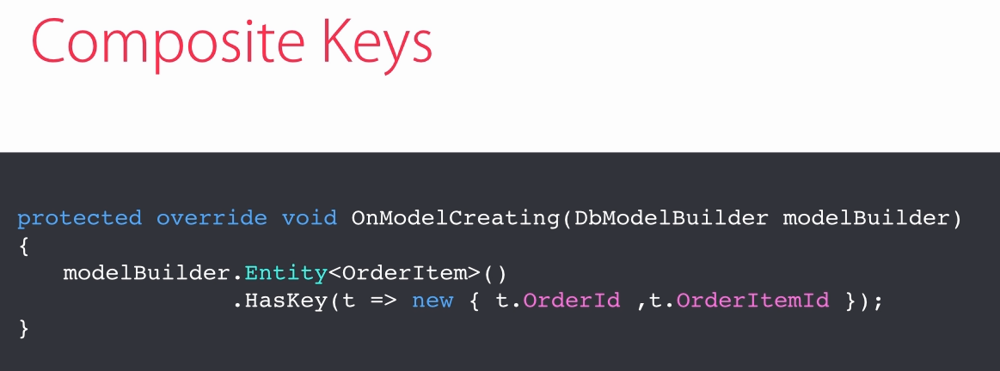

... een anoniem object.


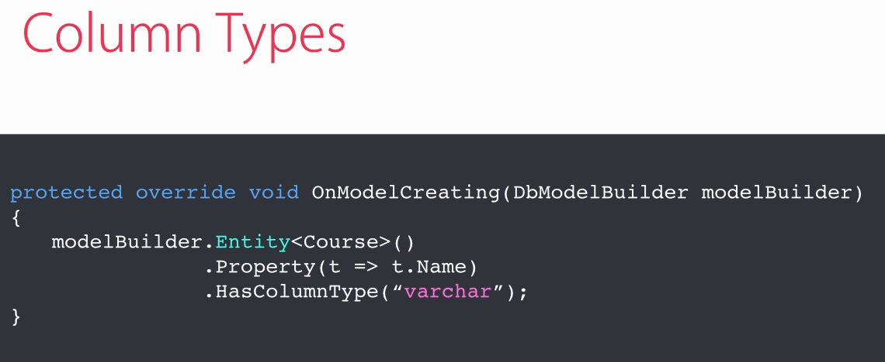


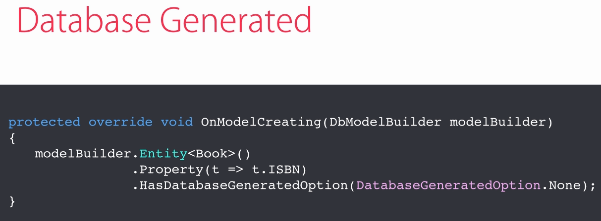

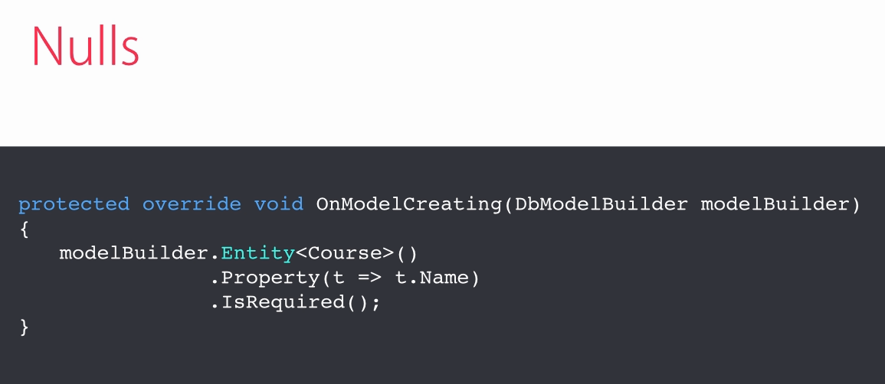


**Voor relaties is Fluent API superieur!**

Voor het leggen van relaties kan je in twee richtingen werken tussen twee types.


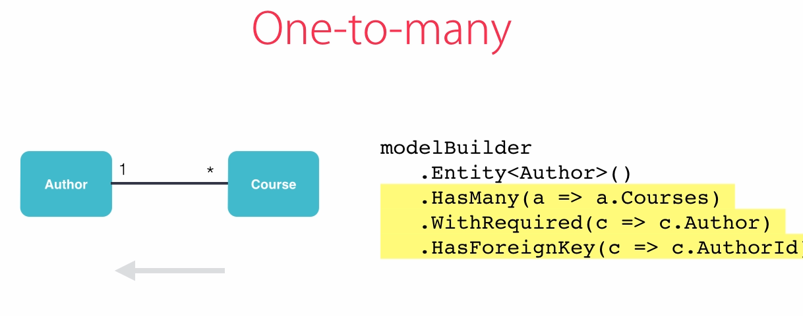

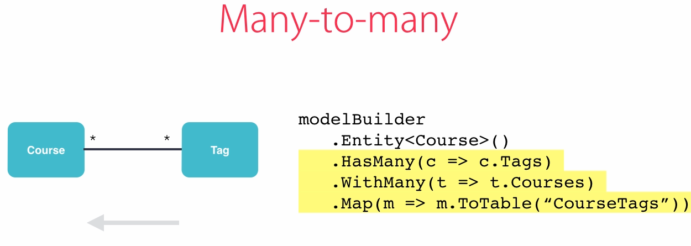

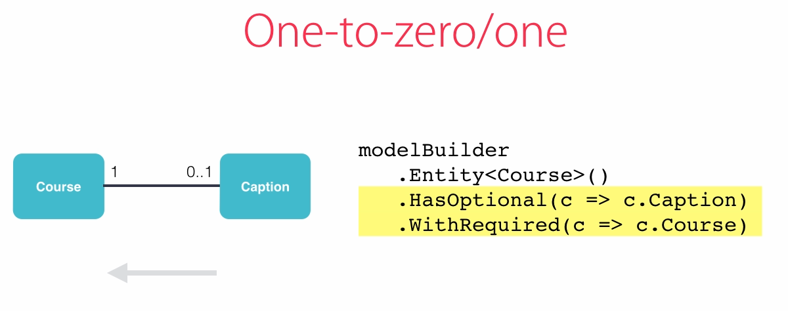

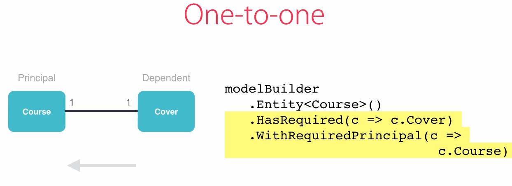

... of:

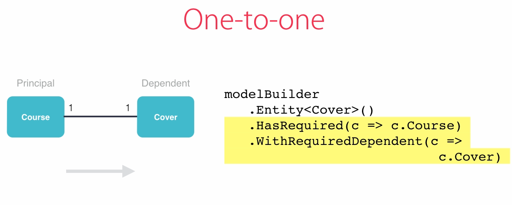

## LINQ voor het opvragen van gegevens

### Language Integrated Query

Een programmeermodel van de hand van Microsoft - brug tussen twee werelden: programmeren, gegevens. Mits een zogenaamde LINQ Provider kan je eender welke gegevensbron ondervragen:

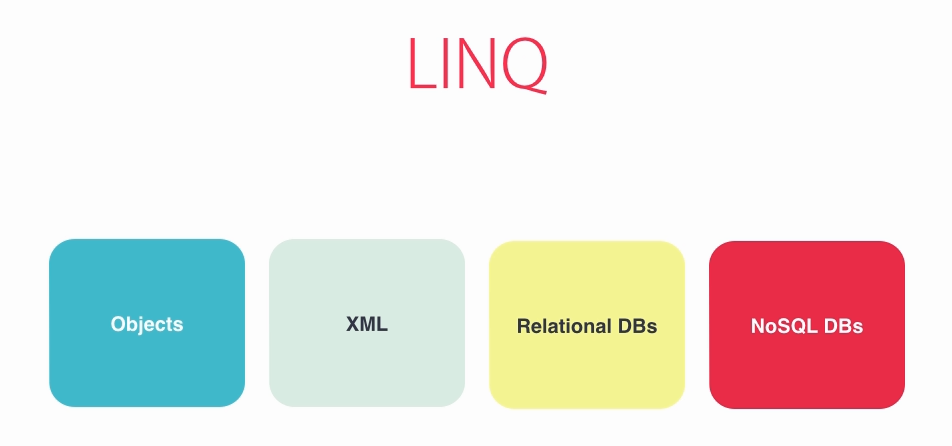


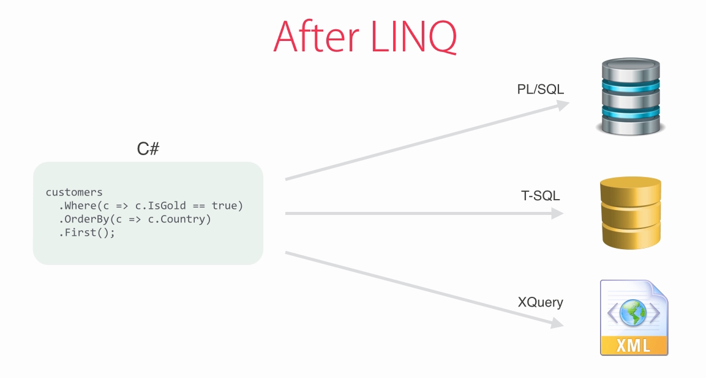

#### Voordelen

* Geen SQL queries en stored procedures meer ...
* Verhoogde productiviteit: dezelfde "taal" en interface

#### Nadelen


Bij grote databanken en wanneer je met ingewikkelde queries moet werken, is SQL met stored procedures beter, handiger, sneller.

### Werken met LINQ

Zie [LINQ overzicht](./Linq.md).

### LINQPad en Entity Framework

Installeer de meest recente versie van LINQPad:


Voor voorbeelden die uitvoerbaar zijn via LINQPad, zie gecomprimeerd bestand [LinqPadExamples.zip](./LinqPadExamples.zip).

Pas je DbContext code aan zodat deze optimaal geschikt is om te gebruiken vanuit LINQPad, gebaseerd op volgend voorbeeld:

```C#
using Microsoft.EntityFrameworkCore;
using Microsoft.Extensions.Configuration;
using System;

namespace Sample.Data
{
	// This class demonstrates how to write constructors on your DbContext class such that:
	//
	//   (a) it's friendly to LINQPad, ASP.NET Core, Visual Studio tools and Migrations
	//   (b) you get better ease and flexiblity in how/where you specify the connection string

	public class SampleDbContext : DbContext
	{
		string _connectionString;

		// The constructor that ASP.NET Core expects. LINQPad can use it too.
		public SampleDbContext(DbContextOptions<SampleDbContext> options) : base(options) { }

		// This constructor is simpler and more robust. Use it if LINQPad errors on the constructor above.
		// Note that _connectionString is picked up in the OnConfiguring method below.
		public SampleDbContext(string connectionString) => _connectionString = connectionString;

		// This constructor obtains the connection string from your appsettings.json file.
		// Tell LINQPad to use it if you don't want to specify a connection string in LINQPad's dialog.
		public SampleDbContext ()
		{
			IConfiguration config = new ConfigurationBuilder().AddJsonFile("appsettings.json").Build();
			_connectionString = config.GetConnectionString("DefaultConnection");
		}

		protected override void OnConfiguring(DbContextOptionsBuilder optionsBuilder)
		{
			// Assign _connectionString to the optionsBuilder:
			if (_connectionString != null)				
				optionsBuilder.UseSqlServer(_connectionString);    // Change to UseSqlite if you're using SQLite

			// Recommended: uncomment the following line to enable lazy-loading navigation hyperlinks in LINQPad:
			// if (InsideLINQPad) optionsBuilder.UseLazyLoadingProxies ();
			// (You'll need to add a reference to the Microsoft.EntityFrameworkCore.Proxies NuGet package, and
			//  mark your navigation properties as virtual.)

			// Recommended: uncomment the following line to enable the SQL trace window:
			// if (InsideLINQPad) optionsBuilder.EnableSensitiveDataLogging (true);
		}

		// This property indicates whether or not you're running inside LINQPad:
		internal bool InsideLINQPad => AppDomain.CurrentDomain.FriendlyName.StartsWith("LINQPad");
	}

	// This is just For Visual Studio design-time support and Migrations (LINQPad doesn't use it).
	// Include this class if you want to specify a different connection string when using Visual Studio design-time tools.
	public class SampleDbContextFactory : Microsoft.EntityFrameworkCore.Design.IDesignTimeDbContextFactory<SampleDbContext>
	{
		public SampleDbContext CreateDbContext(string[] args)
			=> new SampleDbContext("...design-time connection string...");
	}
}
```

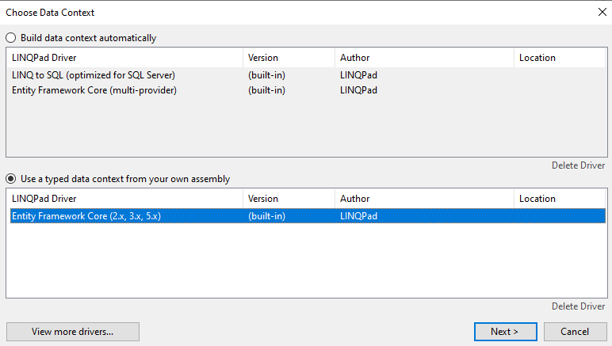

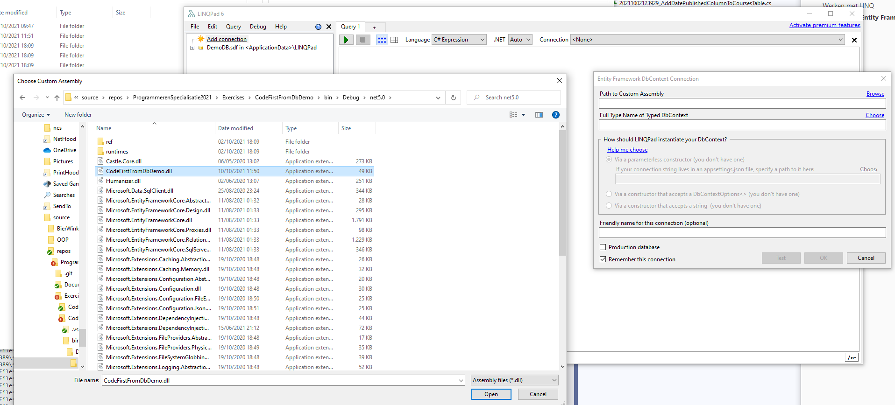


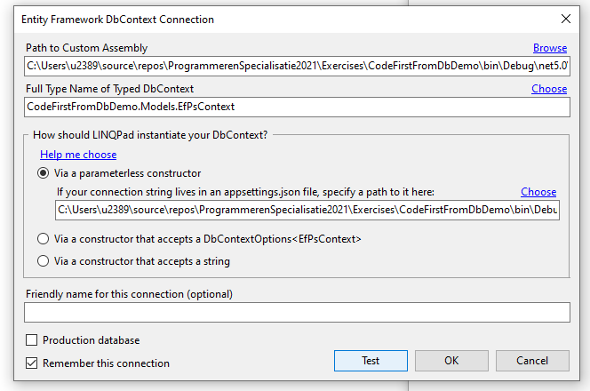

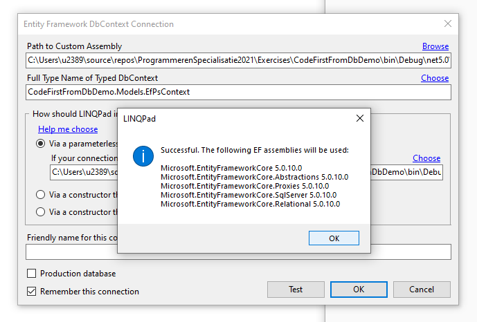


Je kan bijvoorbeeld "Courses" slepen op je editor:


En vervolgens uitvoeren:

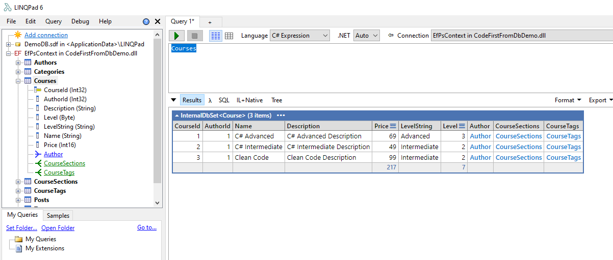

Klik eens op de links in het resultaat: je kan verder doorklikken. Het is zelfs mogelijk om te bekijken welke queries Entity Framework uitvoert. Klikt hiervoor op tab "SQL" in plaats van tab "Results":

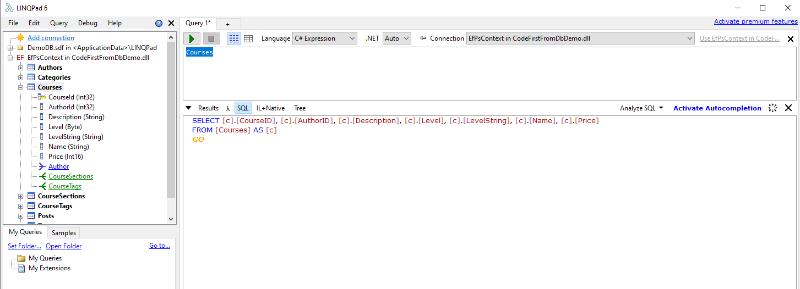

Deze mogelijkheden kunnen gebruikt worden om (LINQ) queries te optimaliseren! Je wijzigt de code en je ziet onmiddellijk wat de SQL queries worden. Je ziet ook de zogenaamde query execution time onder je "SQL" tab. 

Je kan eender welke C# code intikken en het resultaat zien: methode Dump(); Makkelijker dan het watch venster gebruiken in Visual Studio!

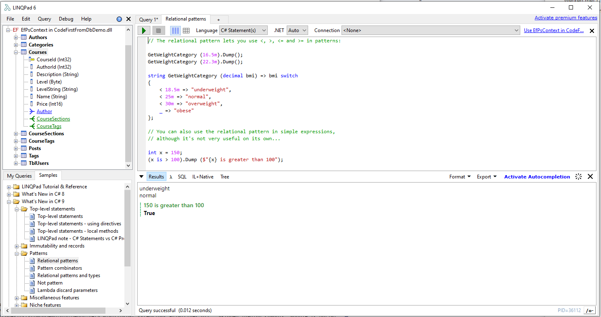

Probeer eens:

```c#
Courses.AsEnumerable().GroupBy(c => c.Level)
```

en bekijk de door Entity Framework gegeneerde SQL: een GroupBy() met LINQ is niet gelijk aan een "GROUP BY" in SQL.

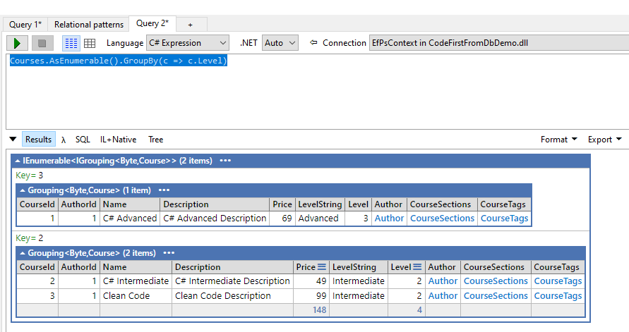

Met oudere versies van Entity Framework kon je "AsEnumerable()" (of: ToList()) weglaten en dan werd een bijzonder ingewikkelde query gegenereerd. 

### SQLProfiler

Start "SSMS" (geef dit in in je zoekbalk) en kies voor Tools > SQL Profiler:


Voer je LINQPad LINQ query uit en bekijk hoe SQL Profiler toont welke queries er uitgevoerd worden op je databank:

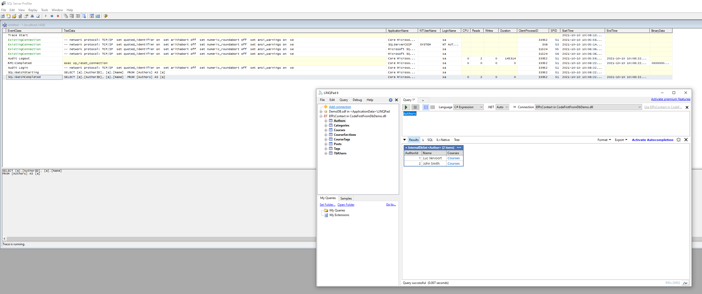

# Eindopdracht: ECB muntwaarden

```c#
// Call a method to get the exchange rate between two currencies: from, to
var exchangeRateUsd = CurrencyConverter.GetExchangeRate("usd", "eur", amount);
var exchangeRateChf = CurrencyConverter.GetExchangeRate("eur", "chf", amount);
```

Implementeer een klasse "CurrencyConverter" met static methodes.

```c#
/// <summary>
/// Available currency tags
/// </summary>
public static string[] GetCurrencyTags()
{
            // Hardcoded currency tags neccesairy to parse the ecb xml's
            return new string[] {"eur", "usd", "jpy", "bgn", "czk", "dkk", "gbp", "huf", "ltl", "lvl"
            , "pln", "ron", "sek", "chf", "nok", "hrk", "rub", "try", "aud", "brl", "cad", "cny", "hkd", "idr", "ils"
            , "inr", "krw", "mxn", "myr", "nzd", "php", "sgd", "zar"};
}
```

Implementeer een methode die currency rates ophaalt bij de ECB in een "canoniek" formaat: we opteren voor EURO.

ECB stelt muntkoersen beschikbaar in RDF/XML formaat: https://en.wikipedia.org/wiki/RDF/XML#:~:text=RDF%2FXML%20is%20a%20syntax,W3C%20standard%20RDF%20serialization%20format (Resource Description Framework, zie ook https://en.wikipedia.org/wiki/Resource_Description_Framework).

"Labeled, directed multi-graph": 

```c#
/// <summary>
/// Get currency exchange rate in euro
/// </summary>
public static decimal GetCurrencyRateInEuro(string currency)
{
  if (currency.ToLower() == "")
    throw new ArgumentException("Invalid argument: currency parameter must be specified.");
  if (currency.ToLower() == "eur")
    return (decimal)1.0;

  try
  {
    // Create with currency parameter, a valid RSS url to ECB euro exchange rate feed
    string rssUrl = string.Concat("http://www.ecb.int/rss/fxref-", currency.ToLower() + ".html");

    // Create & load new Xml document
    System.Xml.XmlDocument doc = new System.Xml.XmlDocument();
    doc.Load(rssUrl);

    // Create XmlNamespaceManager for handling XML namespaces
    System.Xml.XmlNamespaceManager nsmgr = new System.Xml.XmlNamespaceManager(doc.NameTable);
    nsmgr.AddNamespace("rdf", "http://purl.org/rss/1.0/");
    nsmgr.AddNamespace("cb", "http://www.cbwiki.net/wiki/index.php/Specification_1.1");

    // Get list of daily currency exchange rate between selected "currency" and the EURO
    System.Xml.XmlNodeList nodeList = doc.SelectNodes("//rdf:item", nsmgr);

    // Loop Through all XMLNODES with daily exchange rates
    foreach (System.Xml.XmlNode node in nodeList)
    {
      // Create a CultureInfo, this is because EU and USA use different sepperators in float (, or .)
      CultureInfo ci = (CultureInfo)CultureInfo.CurrentCulture.Clone();
      ci.NumberFormat.CurrencyDecimalSeparator = ".";

      try
      {
        // Get currency exchange rate with EURO from XMLNODE
        decimal exchangeRate = decimal.Parse(
          node.SelectSingleNode("//cb:statistics//cb:exchangeRate//cb:value", nsmgr).InnerText,
          NumberStyles.Any, 
          ci);

        return exchangeRate;
      }
      catch { }
    }
      
    // No result
    return (decimal)-1.0;
  }
  catch
  {   
    // No result
    return (decimal)-1.0;
  }
}
```

Deze code kan flink verbeterd worden:

* foutafhandeling: vang uitzonderingen op, controleer alle waarden die teruggegeven worden via methodes.
* voorzie logging (later, via SeriLog).

Implementeer vervolgens methode:

```C#
public static decimal GetExchangeRate(string from, string to, decimal amount = 1)
{
    // Fake:
    return 0.0;
}
```

Bedenk hierbij:

* let op alle randvoorwaarden: wat als de hoeveelheid 0 is of de muntcode is niet behoorlijk opgegeven.
* van "eur" naar "eur" is eenvoudig: er is geen herrekening nodig.
* als je "eur" omrekent naar een andere muntcode, dan moet je vermenigvuldigen en reken je een andere muntcode om naar "eur" dan moet je delen.
* wat als geen van beide muntcodes "eur" is? De rekenformule wordt ingewikkelder: (hoeveelheid * waarde_doelmunt) / waarde_vertrekmunt.

# Git

1. [Cheat Sheet](./GitCheatSheet.pdf)

2. Video's: What is Git?

# Oefening: volg EF Core tutorials 

1. [Get started](./1_EntityFrameworkCore_GetStarted.pdf)
2. [Data modelling](./2_EntityFrameworkCore_DataModelling.pdf)

