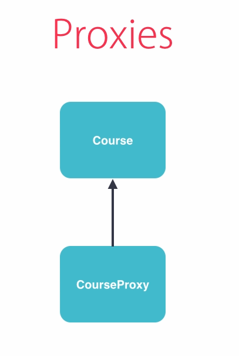
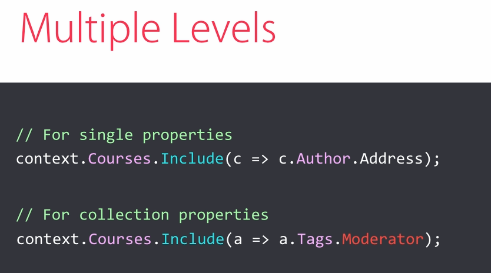
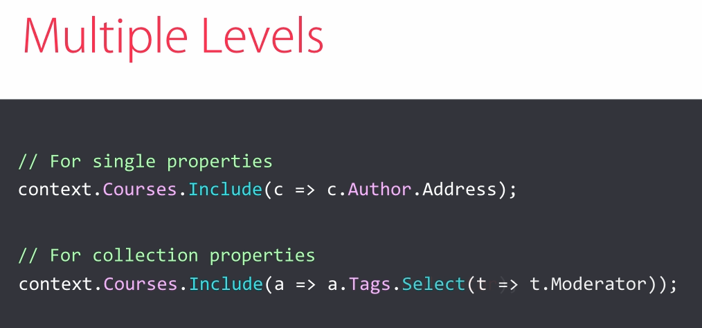
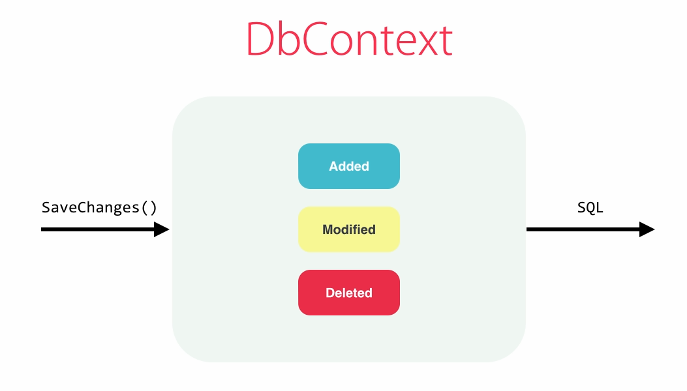
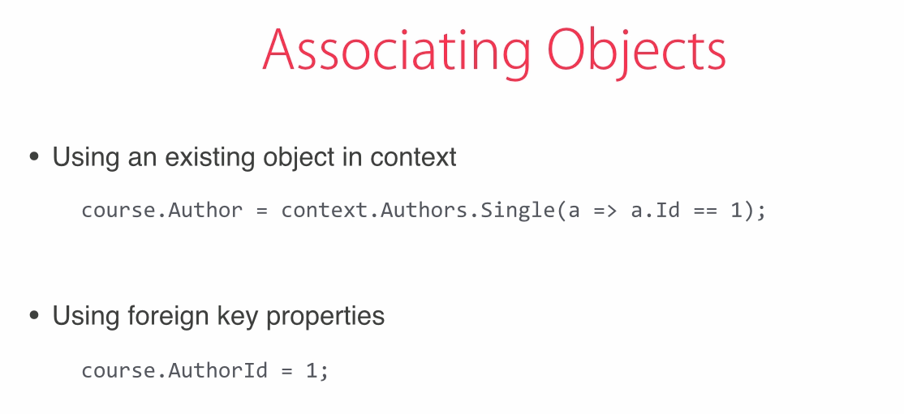
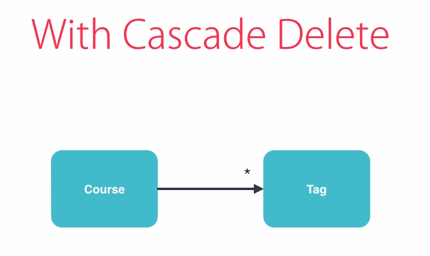
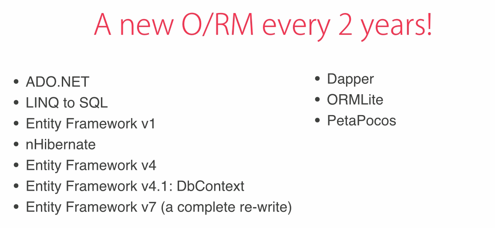
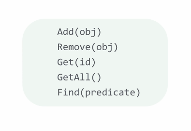
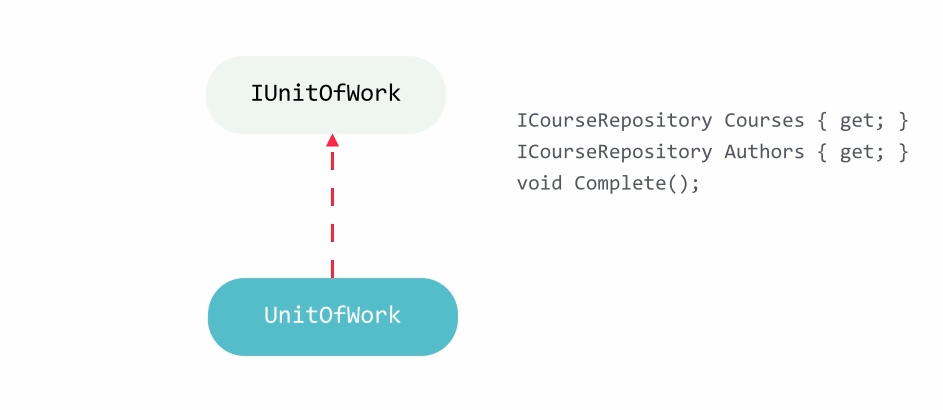

# Loading Related Objects

## Strategie 1: Lazy Loading

Vereenvoudigde voorstelling:




Visual Studio Watch window kan bedrieglijk werken: haalt de onderliggende data op bij het openen. Je kan bestuderen met SQL Profiler wanneer je Visual Studio in combinatie met je code welke queries uitvoert door met de debugger door je code te stappen en te kijken in SQL Profiler wanneer er welke queries uitgevoerd worden.

Om "lazy loading" te activeren, pas je de **DbContext OnConfiguring()** methode aan:

```c#
protected override void OnConfiguring(DbContextOptionsBuilder optionsBuilder)
{
  if (!optionsBuilder.IsConfigured)
  {
    optionsBuilder.UseLazyLoadingProxies(true); // Enables lazy loading; off by default!!
  }
}
```

## Best Practices

- Gebruik *Lazy Loading* wanneer het kostelijk is om je volledige object graph (een object met alle onderliggende objecten) op te vragen.
- Desktop applicaties kunnen wel varen bij *Lazy Loading*: de gebruiker klikt door en de minimale set van benodigde objecten wordt opgevraagd en getoond.
- Bij web applicaties heeft *Lazy Loading* doorgaans een ongunstig effect: wanneer een web client gegevens opvraagt, is het beter dat de service volledig zicht heeft op alle gegevens die doorgegeven moeten worden.

## Het N+1 loading effect

```c#
var courses = context.Courses.ToList();
foreach(var course in courses)
{
    System.Diagnostics.Debug.WriteLine("{0} door {1}", course.Name, course.Author.Name);
}
```

1. Eerst worden alle cursussen opgehaald.
2. De kans bestaat dat vervolgens voor elke cursus de auteurinformatie apart opgehaald (nu is dit wel niet meer het geval bij Entity Framework Core: er wordt gebruik gemaakt van een enkele stored procedure).

Je kan effect dit bestuderen in SQL Profiler.


## Strategie 2: Eager Loading

*Eager Loading* is precies het omgekeerde van *Lazy Loading*. 

```c#
var courses = context.Courses.Include("Author").ToList();
```

De string versie van .Include() gebruiken is geen goede praktijk. Microsoft toont dit nochtans vaak zo. Men noemt een dergelijke string een **"magic string"**. Problemen treden op wanneer je je klasse anders noemt. **Gebruik de lambda versie**:

```c#
using System.Data.Entity;

var courses = context.Courses.Include(c => c.Author).ToList();
```

Wanneer je "refactoring" toepast, blijft je code in orde.

### Eager loading met meer niveau's



Gebruik .Select():



Ook *Eager Loading* kan een goede zaak zijn en een slechte: des te meer je .Include() toepast, des te ingewikkelder/groter worden de gegenereerde queries (je introduceert joins) en des te meer gegevens haal je op in het geheugen, wat vertragend kan werken.

Je moet dus goed nadenken wanneer je *Lazy Loading* of Eager Loading gebruikt.

## Strategie 3: Explicit Loading

MSDN: 

```c#
var author = context.Authors.Single(a => a.Id == 1);
context.Entry(author).Collection(a => a.Courses).Load();
```

Nadelen: 

- veel API te onthouden.
- werkt enkel voor "single entity" (bijvoorbeeld niet voor een hele serie auteurs).

Alternatief:

```c#
var author = context.Authors.Single(a => a.Id == 1);
// Alle cursussen voor deze auteur:
context.Courses.Where(c => c.AuthorId == author.Id).Load();
```

Resultaat in beide gevallen: 2 queries naar de databank.

Een round trip meer kan sneller zijn dan een enorme grote en zware query uitvoeren.

Een filter bij MSDN:

```c#
var author = context.Authors.Single(a => a.Id == 1).Query().Where(c => c.FullPrice == 0).Load();
```

Alternatief:

```c#
context.Courses.Where(c => c.AuthorId == author.Id && c.FullPrice == 0).Load();
```

Conclusie: enkel .Load() onthouden en je queries met Linq schrijven zoals je altijd al deed.

# Change Tracker






```C#
// Add
            {
                var course = new Course
                {
                    Name = "New Course",
                    Description = "New Description",
                    Price = 19,
                    Level = 1,
                    LevelString = "L",
                    Author = new Author() { Name = "Luc Vervoort" } // Change tracker always sees this as a new object!
                };
                context.Courses.Add(course);
                context.SaveChanges();
                // Drie oplossingen voor bestaand auteur object:
                // 1. Bestaand object gebruiken: beter voor WPF
                var authors = context.Authors.ToList();
                var author = context.Authors.Single(a => a.AuthorId == 1);
                var course2 = new Course
                {
                    Name = "New Course 2",
                    Description = "New Description",
                    Price = 19,
                    Level = 1,
                    LevelString = "L",
                    Author = author
                };
                context.Courses.Add(course2);
                context.SaveChanges();
                // 2. Foreign key property gebruiken: beter voor web?
                var course3 = new Course
                {
                    Name = "New Course 3",
                    Description = "New Description",
                    Price = 19,
                    Level = 1,
                    LevelString = "L",
                    AuthorId = 1
                };
                context.Courses.Add(course3);
                context.SaveChanges();
                // 3. Attach object: normaal niet nodig; je gebruikt EF intern en dit is een nadeel
                try
                {
                    var attachedAuthor = new Author() { AuthorId = 1, Name = "Luc Vervoort" }; // genereert tegenwoordig een fout als het object met Id al tracked wordt, bijvoorbeeld 1
                    context.Authors.Attach(attachedAuthor);
                }
                catch(System.Exception e)
                {
                    // System.Console.WriteLine("Op console output");
                    System.Diagnostics.Debug.WriteLine(e.Message); // output komt in debug venster van Visual Studio
                    // The instance of entity type 'Author' cannot be tracked because another instance with the same key value for {'AuthorId'} is already being tracked. When attaching existing entities, ensure that only one entity instance with a given key value is attached.
                    // Consider using 'DbContextOptionsBuilder.EnableSensitiveDataLogging' to see the conflicting key values.
                }
```

# Update met Find() method

Find() beter dan Single met lambda: korter

```c#
var course = context.Courses.Find(4); // Single(c => c.Id == 4)
course.Name = "New Name";
course.AuthorId = 2;
context.SaveChanges();
```

# Verwijderen

## Cascade delete



Enabled by default. Je kan dit omkeren: gebruik .WillCascadeOnDelete(false)

Eerst in context ophalen zodat het object tracked wordt. Vervolgens verwijderen met .Remove() methode: state gaat naar *Deleted*. 

## Zonder cascade delete


Expliciet te doen: eerst Course, dan parent Author. 

Je kan niet meteen een auteur verwijderen omwille van referentiele integriteit. 

Oplossing: *Eager Loading* van auteur met Courses. Find() kan niet met Include(), we moeten .Single() terug gebruiken. Een lijst verwijderen kan beter met RemoveRange() in plaats van met een meervoudige Remove(). 

```c#
var author = context.Authors.Include(a => a.Courses).Single(a => a.AuthorId == 2);
context.Authors.Remove(author);
context.SaveChanges();
```

## Best practices

Vooraleer je echt objecten verwijdert uit een databank: denk na! Soms wil je een verwijderd object terughalen, soms wil je historiek. Daarom beter een booleaanse **IsDeleted** property bij elke klasse zodat je een delete logisch kan uitvoeren en niet "fysisch".

# Change Tracker

State of objects van Change Tracker kan naar een audit trail. Laat toe om te bekijken wat er aan de hand is in een DbContext.

```c#
var trackedAuthors = dbContext.ChangeTracker.Entries<Author>();
foreach(var a in trackedAuthors)
{
  System.Diagnostics.Debug.WriteLine(a.Entity.Name + ": " + a.State);
}
```

Bestudeer properties:

- CurrentValues
- OriginalValues
- ...


```c#
var trackedAuthors = dbContext.ChangeTracker.Entries<Author>();
foreach(var a in trackedAuthors)
{
  System.Diagnostics.Debug.Write(a.CurrentValues["Id"]);
}
```

- States: **Added**, **Modified**, **Updated**,**Unchanged** leiden tot SQL queries.

- **.Reload()**: laat toe terug op te vragen van de databank: overschrijft alle gegevens, ook de state.


# Repository Pattern

## Waarom?

Favoriet onderwerp. Veel opinies en alternatieven.




## Hoe?

Het gaat over objecten in het geheugen:



... dus niet Update(), Save(), ... . 


Je moet je "frameworks" als tools kunnen gebruiken en nastreven er niet afhankelijk van te zijn:




## Repository in de praktijk

We bespreken het voorbeeld onder [github](https://github.com/lucvervoort/ProgrammerenSpecialisatie2021/tree/main/Examples/RepositoryExample).

Generiek: kan gecopieerd worden in alle applicaties die een ORM gebruiken (los van EF)

```C#
using System;
using System.Collections.Generic;
using System.Linq.Expressions;

namespace Queries.Core.Repositories
{
    // CRUD
    public interface IRepository<TEntity> where TEntity : class
    {
        // R
        TEntity Get(int id);
        IEnumerable<TEntity> GetAll();
        IEnumerable<TEntity> Find(Expression<Func<TEntity, bool>> predicate);

        TEntity SingleOrDefault(Expression<Func<TEntity, bool>> predicate);

        // C
        void Add(TEntity entity);
        void AddRange(IEnumerable<TEntity> entities);
        
        // D
        void Remove(TEntity entity);
        void RemoveRange(IEnumerable<TEntity> entities);
    }
}
```

Implementatie voor EF: kan gecopieerd worden in alle applicaties die onderliggend EF wensen te gebruiken

```C#
using Microsoft.EntityFrameworkCore;
using Queries.Core.Repositories;
using System;
using System.Collections.Generic;
using System.Linq;
using System.Linq.Expressions;

namespace Queries.Persistence.Repositories
{
    public class Repository<TEntity> : IRepository<TEntity> where TEntity : class
    {
        protected readonly DbContext Context;

        public Repository(DbContext context)
        {
            Context = context;
        }

        public TEntity Get(int id)
        {
            // Here we are working with a DbContext, not CourseContext. So we don't have DbSets 
            // such as Courses or Authors, and we need to use the generic Set() method to access them.
            return Context.Set<TEntity>().Find(id);
        }

        public IEnumerable<TEntity> GetAll()
        {
            // Note that here I've repeated Context.Set<TEntity>() in every method and this is causing
            // too much noise. I could get a reference to the DbSet returned from this method in the 
            // constructor and store it in a private field like _entities. This way, the implementation
            // of our methods would be cleaner:
            // 
            // _entities.ToList();
            // _entities.Where();
            // _entities.SingleOrDefault();
            // 
            // I didn't change it because I wanted the code to look like the videos. But feel free to change
            // this on your own.
            return Context.Set<TEntity>().ToList();
        }

        public IEnumerable<TEntity> Find(Expression<Func<TEntity, bool>> predicate)
        {
            return Context.Set<TEntity>().Where(predicate);
        }

        public TEntity SingleOrDefault(Expression<Func<TEntity, bool>> predicate)
        {
            return Context.Set<TEntity>().SingleOrDefault(predicate);
        }

        public void Add(TEntity entity)
        {
            Context.Set<TEntity>().Add(entity);
        }

        public void AddRange(IEnumerable<TEntity> entities)
        {
            Context.Set<TEntity>().AddRange(entities);
        }

        public void Remove(TEntity entity)
        {
            Context.Set<TEntity>().Remove(entity);
        }

        public void RemoveRange(IEnumerable<TEntity> entities)
        {
            Context.Set<TEntity>().RemoveRange(entities);
        }

        public DbContext DbContext
        {
            get { return Context; }
        }
    }
}
```

Specifiek voor je project (per klasse bij EF gebruikt voor een DbSet<>):

```C#
using Queries.Core.Domain;

namespace Queries.Core.Repositories
{
    // LVET: IRepository is generic, but here we specify project class related methods
    public interface IAuthorRepository : IRepository<Author> // contract dat we opleggen aan wie de interface implementeert
    {
        Author GetAuthorWithCourses(int id);
    }
}
```

Implementatie:

```C#
using Microsoft.EntityFrameworkCore;
using Queries.Core.Domain;
using Queries.Core.Repositories;
using System.Linq;

namespace Queries.Persistence.Repositories
{
    public class AuthorRepository : Repository<Author>, IAuthorRepository
    {
        public AuthorRepository(CourseContext context) : base(context)
        {
        }

        public Author GetAuthorWithCourses(int id)
        {
            return ((CourseContext)DbContext).Authors.Include(a => a.Courses).SingleOrDefault(a => a.Id == id);
        }
    }
}
```

IUnitOfWork Generiek:

```C#
using System;

namespace Queries.Core
{
    public interface IUnitOfWorkBase: IDisposable
    {
        int Complete();
    }
}
```

Specifiek voor je project:

```C#
using Queries.Core.Repositories;

namespace Queries.Core
{

    public interface IUnitOfWork : IUnitOfWorkBase
    {
        ICourseRepository Courses { get; }
        IAuthorRepository Authors { get; }
    }
}
```

Implementatie:

```C#
using Queries.Core;
using Queries.Core.Repositories;
using Queries.Persistence.Repositories;

namespace Queries.Persistence
{
    public class UnitOfWork : IUnitOfWork
    {
        // DbContext is wrapped: not exposed
        private readonly CourseContext _context;

        public ICourseRepository Courses { get; private set; }
        public IAuthorRepository Authors { get; private set; }

        public UnitOfWork(CourseContext context)
        {
            _context = context;
            Courses = new CourseRepository(_context);
            Authors = new AuthorRepository(_context);
        }

        public int Complete()
        {
            return _context.SaveChanges();
        }

        public void Dispose()
        {
            _context.Dispose();
        }
    }
}
```

# Oefeningen in te dienen onder Chamilo: EF Core tutorials 

1. [Get started](./1_EntityFrameworkCore_GetStarted.pdf)
2. [Data modelling](./2_EntityFrameworkCore_DataModelling.pdf)
3. [CRUD](./4_EntityFramework_CRUD.pdf)

