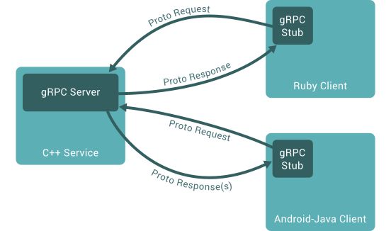

Tasks: https://csharphardcoreprogramming.wordpress.com/2013/12/04/tasks-basics/

Serializatie: ProtocolBuffers

https://csharphardcoreprogramming.wordpress.com/2014/01/28/protocol-buffers-part-2-advanced-tcp-networking/

# gRPC

## Inleidend

Door dit voorbeeld te doorlopen zal je leren hoe je:

- een service definieert in een .proto bestand.
- server en client code genereert met behulp van de protocol buffer compiler.
- De C# gRPC API gebruikt om een eenvoudige client en server voor je service te schrijven.

In gRPC kan een client toepassing rechtstreeks een methode aanroepen op een server toepassing op een andere machine alsof het een lokaal object is, waardoor het gemakkelijker wordt om gedistribueerde toepassingen en diensten te creëren. Zoals in veel RPC systemen, is gRPC gebaseerd op de idee van het definiëren van een service, het specificeren van de methodes die op afstand kunnen worden aangeroepen met hun parameters en return types. Aan de serverzijde implementeert de server deze interface en draait een gRPC server om de cliëntoproepen af te handelen. Aan de kant van de client heeft de client een stub (in sommige talen gewoon client genoemd) die dezelfde methoden biedt als de server.





gRPC clients en servers kunnen draaien en met elkaar praten in verschillende omgevingen - van servers binnen Google tot uw eigen desktop - en kunnen geschreven worden in elk van de ondersteunde talen van gRPC. U kunt dus bijvoorbeeld eenvoudig een gRPC-server in Java maken met clients in Go, Python of Ruby. Bovendien zullen de nieuwste Google API's gRPC-versies van hun interfaces hebben, zodat u gemakkelijk Google-functionaliteit in uw toepassingen kunt inbouwen.

## Werken met Protocol Buffers

Standaard gebruikt gRPC Protocol Buffers, Google's volwassen open source mechanisme voor het serialiseren van gestructureerde gegevens (hoewel het kan worden gebruikt met andere gegevensformaten zoals JSON). Hier is een korte intro over hoe het werkt. Als je al bekend bent met protocol buffers, voel je vrij om door te gaan naar de volgende sectie.

De eerste stap bij het werken met protocol buffers is het definiëren van de structuur voor de gegevens die u wilt serialiseren in een proto bestand: dit is een gewoon tekstbestand met een .proto extensie. Protocol buffer gegevens zijn gestructureerd als berichten, waarbij elk bericht een klein logisch record van informatie is dat een reeks naam-waarde paren bevat die velden worden genoemd. Hier is een eenvoudig voorbeeld:

```proto
message Person {
  string name = 1;
  int32 id = 2;
  bool has_ponycopter = 3;
}
```

Dan, zodra je je gegevensstructuren hebt gespecificeerd, gebruik je het protocol buffer compiler protoc om toegangsklassen voor gegevens te genereren in je voorkeurstaal/talen vanuit je proto-definitie. Deze bieden eenvoudige accessors voor elk veld, zoals name() en set_name(), evenals methoden om de hele structuur te serialiseren/parsen naar/van ruwe bytes. Dus, bijvoorbeeld, als je gekozen taal C++ is, dan zal het uitvoeren van de compiler op het bovenstaande voorbeeld een klasse genereren die Person heet. U kunt dan deze klasse in uw toepassing gebruiken om Person protocol buffer berichten te vullen, te serialiseren, en op te halen.

U definieert gRPC services in gewone proto bestanden, met RPC methode parameters en return types gespecificeerd als protocol buffer boodschappen:

```proto
// The greeter service definition.
service Greeter {
  // Sends a greeting
  rpc SayHello (HelloRequest) returns (HelloReply) {}
}

// The request message containing the user's name.
message HelloRequest {
  string name = 1;
}

// The response message containing the greetings
message HelloReply {
  string message = 1;
}
```

gRPC gebruikt protoc met een speciale gRPC plugin om code te genereren uit je proto-bestand: je krijgt gegenereerde gRPC client en server code, evenals de gewone protocol buffer code voor het vullen, serialiseren, en ophalen van je berichttypes.

### Protocol buffer versies 

Hoewel protocol buffers al enige tijd beschikbaar zijn voor open source gebruikers, gebruiken de meeste voorbeelden protocol buffers versie 3 (proto3), die een iets vereenvoudigde syntaxis heeft, enkele nuttige nieuwe functies, en meer talen ondersteunt. Proto3 is momenteel beschikbaar in Java, C++, Dart, Python, Objective-C, C#, een lite-runtime (Android Java), Ruby, en JavaScript van de protocol buffers GitHub repo, evenals een Go taal generator van het golang/protobuf officiële pakket, met meer talen in ontwikkeling. U kunt meer te weten komen in de proto3 taalgids en de referentiedocumentatie die beschikbaar is voor elke taal. De referentie documentatie bevat ook een formele specificatie voor het .proto bestandsformaat.

In het algemeen, hoewel je proto2 kunt gebruiken, raden we aan dat je proto3 gebruikt met gRPC omdat het je in staat stelt de volledige reeks van gRPC-ondersteunde talen te gebruiken, en ook compatibiliteitsproblemen te vermijden met proto2 clients die praten met proto3 servers en vice versa.

## Waarom gRPC gebruiken?

Ons voorbeeld is een eenvoudige route mapping toepassing die clients informatie laat krijgen over kenmerken op hun route, een samenvatting van hun route laat maken, en route informatie zoals verkeersupdates laat uitwisselen met de server en andere clients.

Met gRPC kunnen we onze service eenmalig definiëren in een .proto bestand en clients en servers genereren in elk van de door gRPC ondersteunde talen, die op hun beurt kunnen worden uitgevoerd in omgevingen variërend van servers in een groot datacenter tot uw eigen tablet - alle complexiteit van communicatie tussen verschillende talen en omgevingen wordt voor u afgehandeld door gRPC. We krijgen ook alle voordelen van het werken met protocol buffers, inclusief efficiënte serialisatie, een eenvoudige IDL, en het gemakkelijk updaten van de interface.

https://docs.microsoft.com/nl-be/aspnet/core/grpc/?view=aspnetcore-5.0

https://michaelscodingspot.com/rest-vs-grpc-for-asp-net/